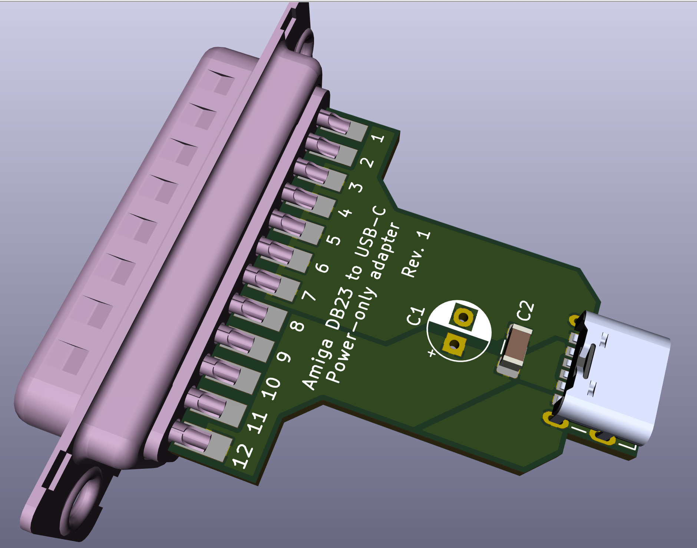
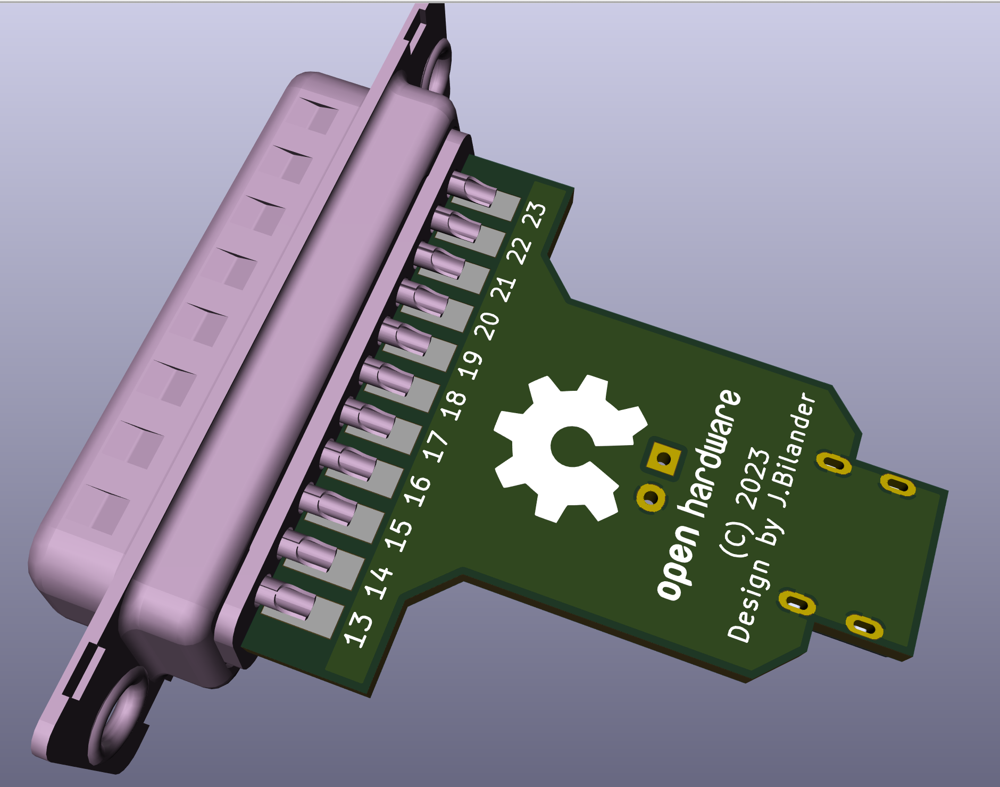

# Amiga_DB23_to_USB_C_power_only_adapter
Amiga +5V from external D-sub DB23 floppy drive port to USB Receptacle Type C

***

***

BOM Rev. 1
---------
Designator  | Name/Value   | Package | Notes
-|-|-|-|
J1 | D-Sub DB23 Male connector | EdgeMount, floppy port connector solder type |
J2 | USB Type-C Socket SMD DIP Female Jack For PCB | TYPE-C-01 | [TYPE-C-01](https://www.aliexpress.com/item/1005005371954812.html)
C1 | Capacitor Radial Polarized 100uF | 2.5mm pitch, Through-Hole | [100uF 25V](https://www.aliexpress.com/item/1005005357747187.html)  Bend down flat to the board surface (in order to fit under shell)
C2 | Capacitor 10uF | 1206 SMD | [1206 10uF X5R 10% 16V](https://www.aliexpress.com/item/33057694240.html)
X | D-Sub DB23 Cover | Two DB23 plastic shells with screws and nuts | Plastic hood cover x 2

***
