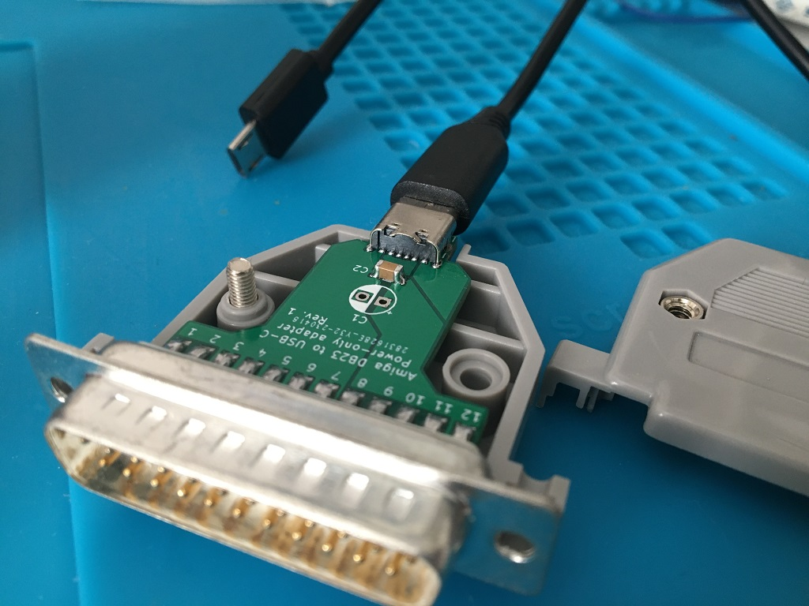
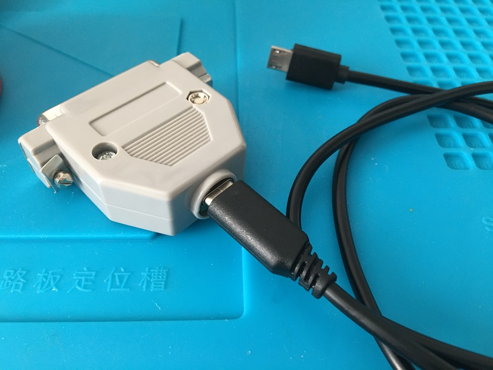
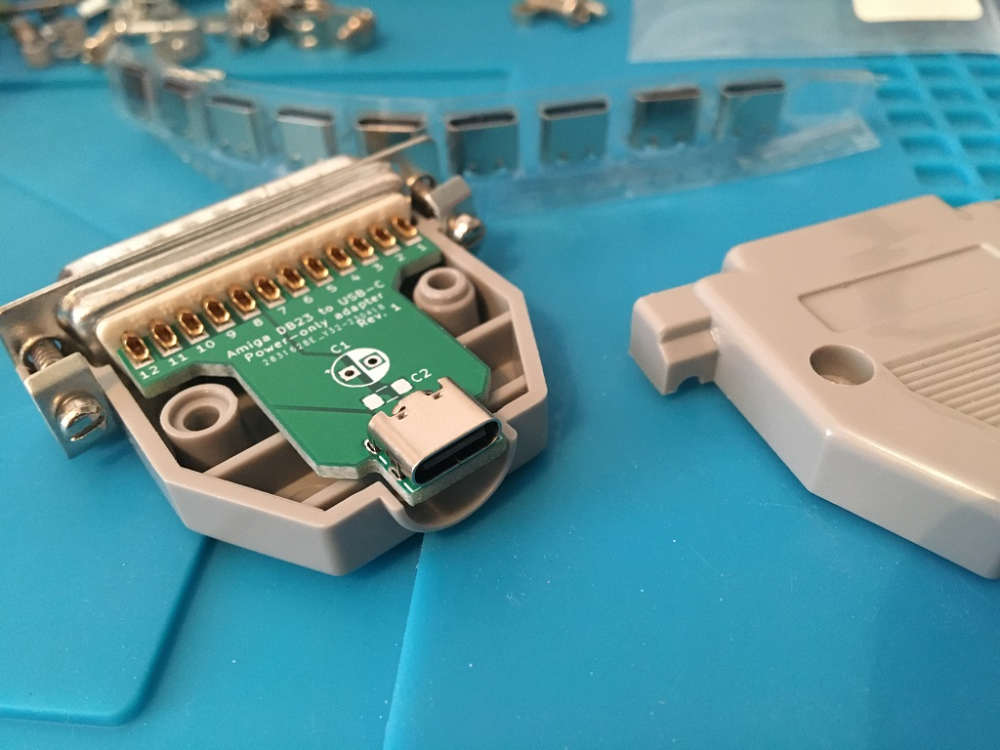
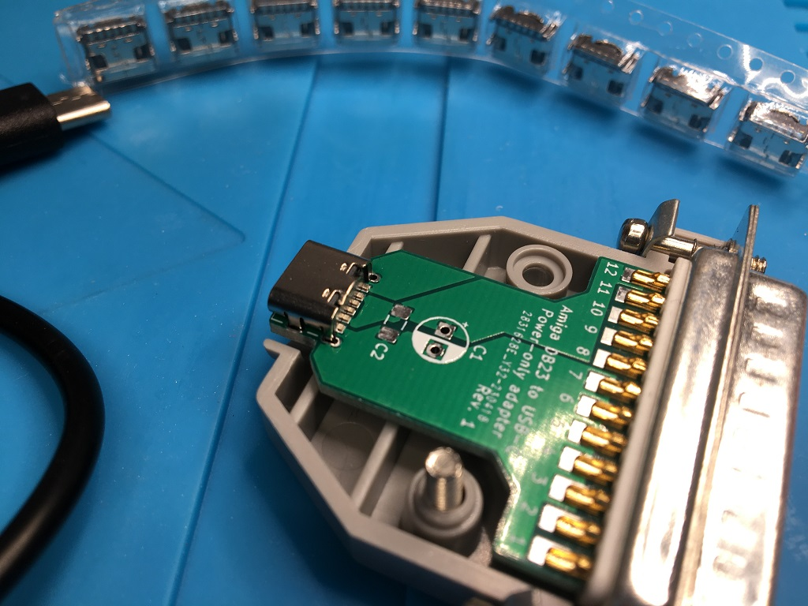
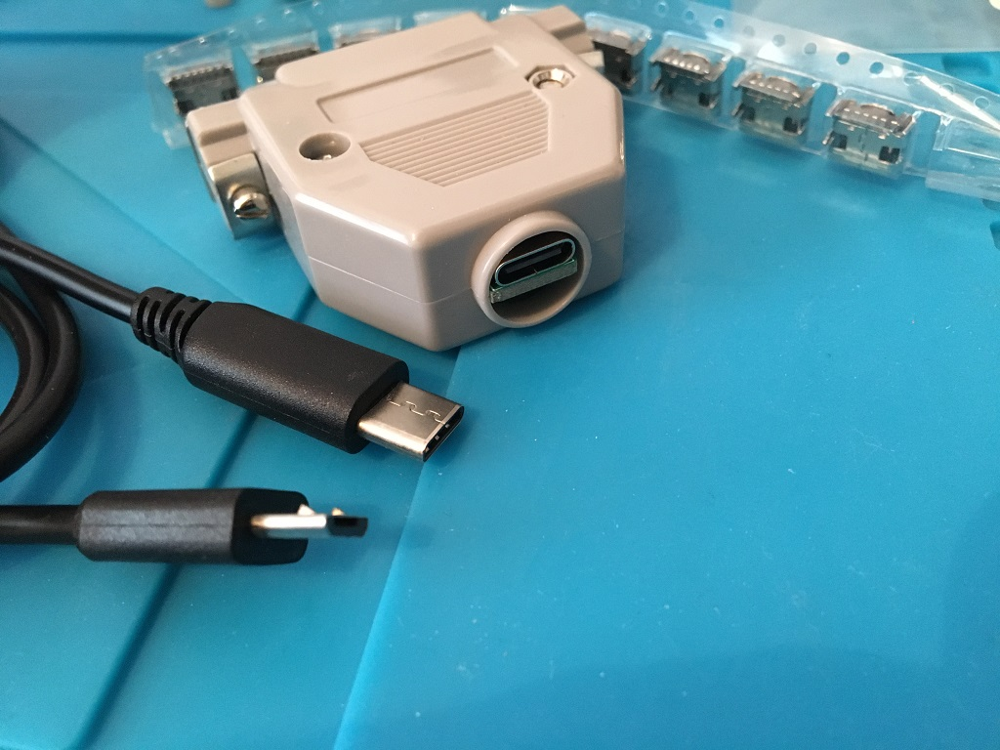
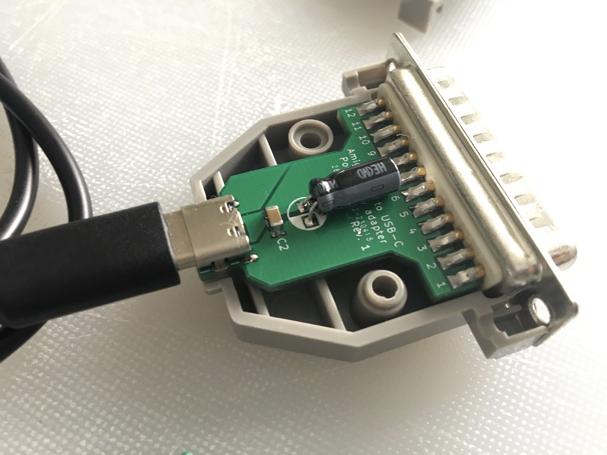
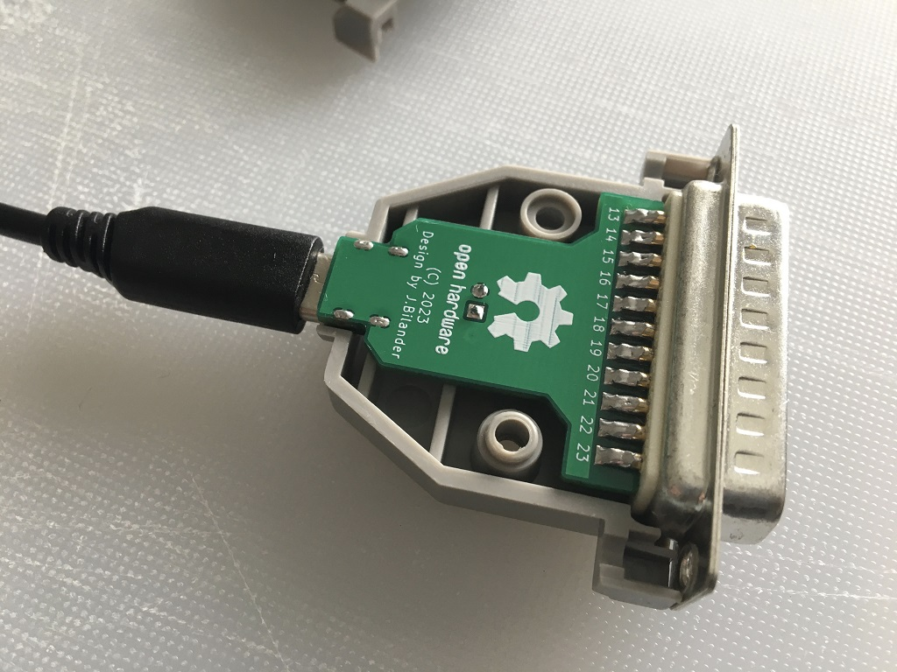
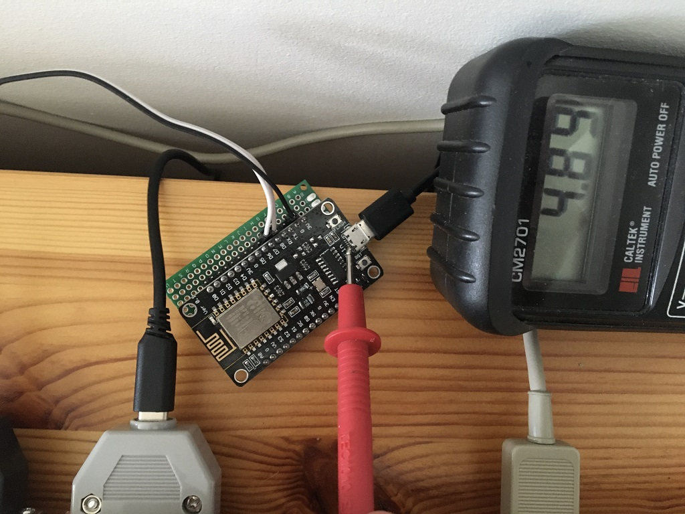

# Amiga_DB23_to_USB_C_power_only_adapter
Amiga +5V from external D-sub DB23 floppy drive port to USB Receptacle Type C

***

 

 

 

***

BOM Rev. 1
---------
Designator  | Name/Value   | Package | Notes
-|-|-|-|
J1 | D-Sub DB23 Male connector | EdgeMount, floppy port connector solder type | [DB23M](https://www.networkcables.com/proddetail.php?prod=CO23MS&cat=52)
J2 | USB Type-C Socket SMD DIP Female Jack For PCB | TYPE-C-01 | [TYPE-C-01](https://www.aliexpress.com/item/1005005371954812.html)
C1 | Capacitor Radial Polarized 100uF | 2.5mm pitch, Through-Hole | [100uF 10V](https://www.digikey.com/en/products/detail/nichicon/UHE1A101MDD/589232)  Bend down flat to the board surface (in order to fit under shell)
C2 | Capacitor 10uF | 1206 SMD | [1206 10uF X5R 10% 16V](https://www.aliexpress.com/item/33057694240.html)
X | D-Sub DB23 Cover | Two DB23 plastic shells with screws and nuts | [Plastic hood cover x 2](https://www.aliexpress.com/item/1005005014449948.html)

***
